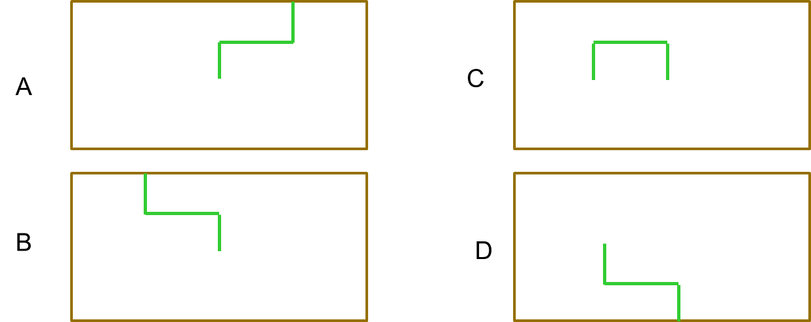
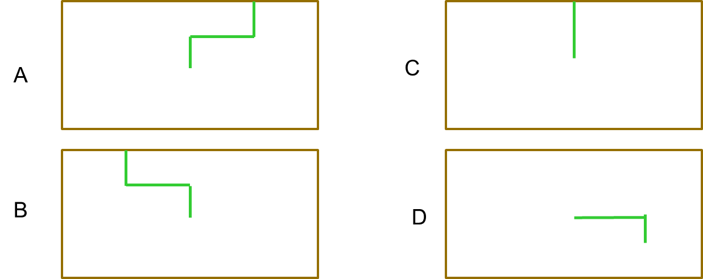

# Instructions  
## Look ahead for this class


## Turtle in a world
https://docs.python.org/3/library/turtle.html

A lot of functions
- forward
- backward
- right
- left
- goto
- penup
- pendown
- pencolor


## What does this code draw?
```python
left(90)
forward(25)
left(90)
forward(50)
right(90)
forward(25)
```

Hint: Turtles start facing right


## ## What does this code draw?
```python
left(90)
forward(25)
#note the change of order
forward(50)
left(90)
right(90)
forward(25)
```

Hint: Turtles start facing right



## Practice
1. Please use turtle to write at least one letter in your name

2. Please use the turtle to draw a house