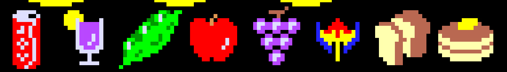

Use the following codes as hints for the pacman special power items



```python
    magnet = powerups[0]
    if player.get_rect().colliderect(pygame.Rect(magnet[1], magnet[2], 32, 32)):
        for p in pellets:
            if p.x < player.x:
                p.x += 1
            else:
                p.x -= 1
            if p.y < player.y:
                p.y += 1
            else:
                p.y -= 1
    
    plant = powerups[1]
    if player.get_rect().colliderect(pygame.Rect(plant[1], plant[2], 32, 32)):
        pellets = pellet_init()

    fat = powerups[2]
    if player.get_rect().colliderect(pygame.Rect(fat[1], fat[2], 32, 32)):
        player.image = scale2x(player.image)

    poison = powerups[3]
    if hit(blinky, poison):
      blinky.x = SCREEN_WIDTH//2
      blinky.y = SCREEN_HEIGHT//2 - 30
    if hit(inky, poison):
      inky.x = SCREEN_WIDTH//2
      inky.y = SCREEN_HEIGHT//2 - 30
    if hit(pinky, poison):
      pinky.x = SCREEN_WIDTH//2
      pinky.y = SCREEN_HEIGHT//2 - 30
    if hit(clyde, poison):
      clyde.x = SCREEN_WIDTH//2
      clyde.y = SCREEN_HEIGHT//2 - 30


    tele = powerups[4]
    if hit(player, tele):
      player.x = clyde.x + 50
      player.y = clyde.y + 50
      player.clamp()

    nuke = powerups[5]
    if hit(player, nuke):
      pellets.clear()

    shield = powerups[6]
    if hit(player, shield):
      invincible = True
    else:
      invincible = False

    death = powerups[7]
    if hit(player, death):
      blinky.x = player.x + 50
      blinky.y = player.y + 50
      blinky.clamp()
      inky.x = player.x - 50
      inky.y = player.y - 50
      inky.clamp()
      pinky.x = player.x + 50
      pinky.y = player.y + 50
      pinky.clamp()


```
