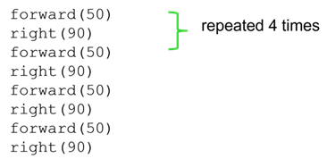
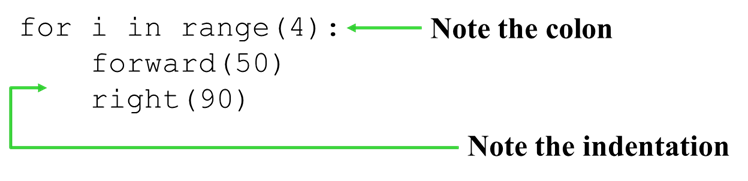
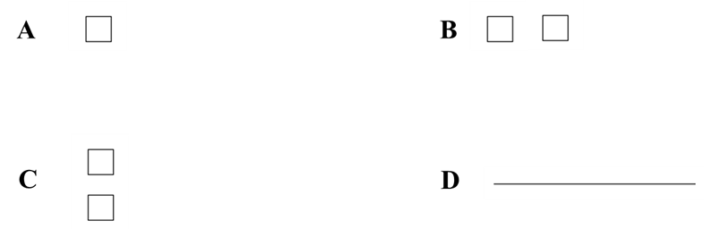
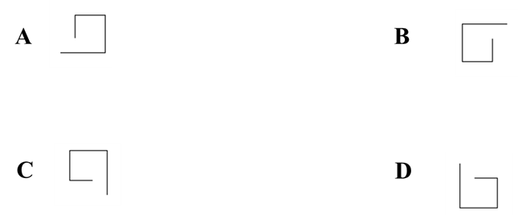
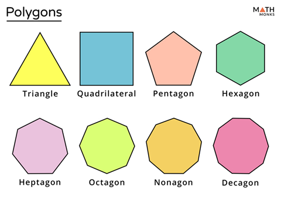

# Loops in python

## Introduction to loops
Loops repeat an action MANY, MANY TIMES.
Example: Draw a square of 50 by 50 


We can use loops to automate



## Exercises
### 1. What shape will be created if the following code is run?

```python
for i in range(8):
    forward(30)
    right(90)
```




<div style="page-break-after: always;"></div>

### 2. What shape will be created if the following code is run?

```python
for i in range(4):
    forward(30 + i * 3)
    right(90)
```




### 3. Draw a polygon


### 4. Draw a fancy shape (homework)
Create a fancy shape using basic loops