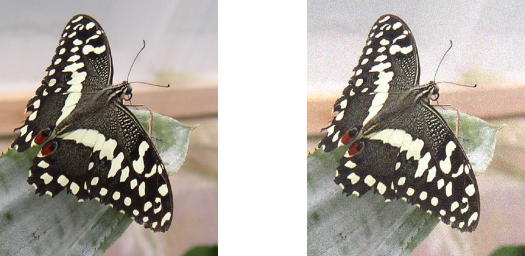

# Day 5 – Basic Picture Processing

## Pixels 
- Made of pixels in a grid (width by height)
- Each pixel has three color channels (RGB)
- We manipulate pictures by manipulating pixels one by one


## Colors 
- Each component color (red, green, and blue) is encoded as a single byte
- Colors go from (0,0,0) to (255,255,255). you can play with color picker from google
- If all three components are the same, the color is in greyscale

    - (200,200,200) 
    - (0,0,0) 
    - (255,255,255)


## Basic steps in image processing

```python
#import package
from PIL import Image

#start to read in the picture.
#picture should be in the same folder as the py file
pic = Image.open('butterfly.jpg')


#get the size of the picture
[width, height] = pic.size
pixels = pic.load()

#nested loop to process a picture
for x in range(width):
    for y in range(height):
        (r, g, b) = pixels[x, y]
        # This step is key to do something to a pixel

pic.save('result.jpg')

```


## Exercise 1: Darken a picture


Note. 5/2 in python is 2.5,    5//2 in python is 2


## Exercise 2: Salt and Pepper
- Distort your picture by adding in salt and pepper to the picture
- Hint: use random to generate random noise and add to pixel’s RGB



# Homework

* Create a filter that change your picture

Examples:
    * remove all red or blue or green
    * grey out a picture
