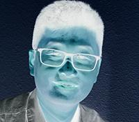
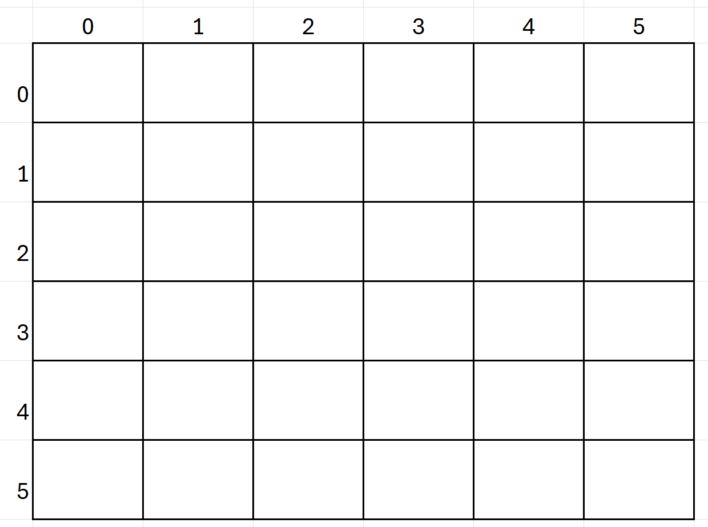
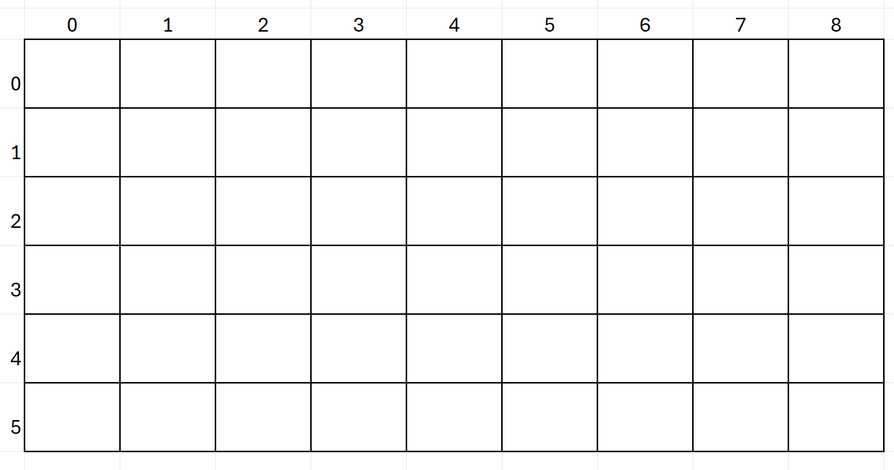

# Image Processing
## 1. Image processing basics

- Made of pixels in a grid (width by height)
- Each pixel has three color channels (RGB)
- We manipulate pictures by manipulating pixels one by one

```python
from PIL import Image
import random

pic = Image.open('butterfly.jpg')

#get the size of the picture
[width, height] = pic.size
pixels = pic.load()

for x in range(width):
  for y in range(height):
    (r, g, b) = pixels[x, y]
    # Do sth here

pic.save('newPic.jpg')
```
## 2. Negative Effect
Create a negative effect on the given picture





## 3. Symmetry in image processing

